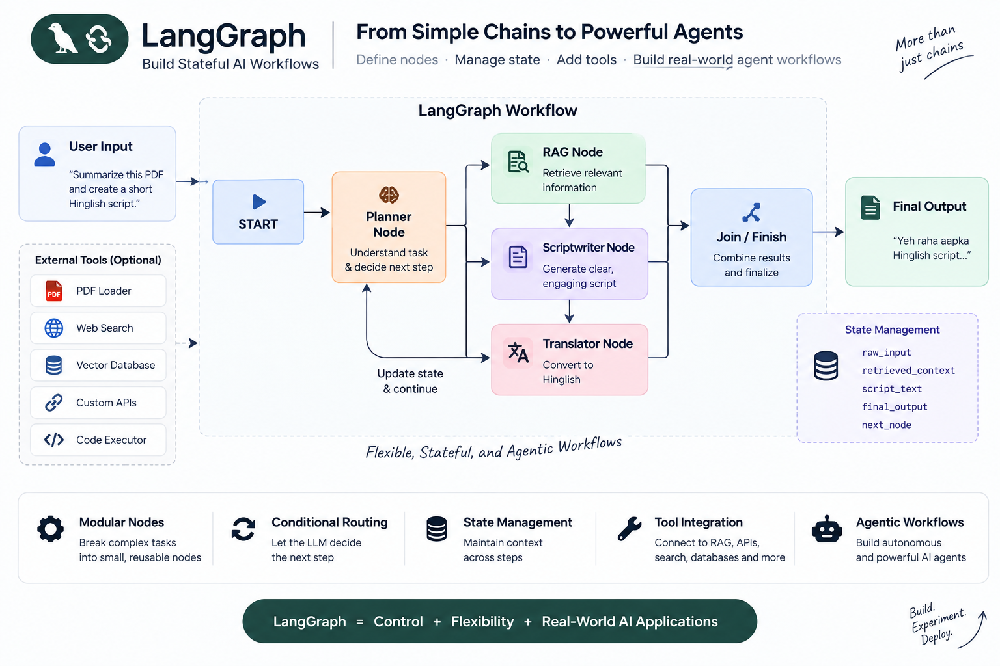

<div align="center">



# 🧠 LangGraph Agent Workflows

### Building AI Agents & Workflows with LangGraph

A hands-on learning repository focused on understanding and building
**LLM-powered workflows, AI agents, conditional routing, tool calling, and RAG systems using LangGraph.**

</div>

---

## 🚀 About This Repository

This repository contains my practical journey of learning **LangGraph** by building AI workflows step by step.

The focus is not just on using LangGraph APIs, but on understanding how to design:

- Stateful AI workflows
- Multi-step LLM pipelines
- Agentic systems
- Conditional routing
- Tool-calling workflows
- RAG-based applications
- Complex AI decision flows

---

## 🧩 What I'm Learning

### LangGraph Fundamentals

- Graph-based workflow design
- Nodes
- Edges
- State management
- START and END nodes
- Graph compilation
- Workflow execution

### AI Agent Concepts

- Agent workflows
- LLM decision making
- Conditional routing
- Tool calling
- Multi-step reasoning workflows
- Agent state management

### Advanced Workflows

- Sequential workflows
- Conditional workflows
- Parallel workflows
- Human-in-the-loop workflows
- RAG workflows
- Multi-agent systems

---

## 📂 Repository Structure

```text
langgraph-agent-workflows/
│
├── asset/
│   └── langgraph-workflow.png
│
├── sequential-workflow/
│   └── ...
│
├── .gitignore
├── requirements.txt
└── README.md
🛠️ Tech Stack
🐍 Python
🦜 LangChain
🧠 LangGraph
🤖 Large Language Models
🔐 Python-dotenv
🔧 LLM APIs
⚙️ Installation
1. Clone the repository
git clone https://github.com/dharmeshsharma8085/langgraph-agent-workflows.git
cd langgraph-agent-workflows
2. Create a virtual environment
python -m venv .venv
3. Activate the virtual environment

Windows:

.venv\Scripts\activate

Linux / macOS:

source .venv/bin/activate
4. Install dependencies
pip install -r requirements.txt
🔐 Environment Variables

Create a .env file in the root directory:

OPENAI_API_KEY=your_api_key_here

⚠️ Never commit your .env file or API keys to GitHub.

▶️ Running the Workflows

Navigate to the workflow directory and run the required Python file.

Example:

python filename.py

The exact command may vary depending on the workflow being explored.

🧠 Learning Roadmap
LangGraph Fundamentals
        │
        ▼
State Management
        │
        ▼
Nodes & Edges
        │
        ▼
Sequential Workflows
        │
        ▼
Conditional Routing
        │
        ▼
AI Agents
        │
        ▼
Tool Calling
        │
        ▼
RAG Workflows
        │
        ▼
Multi-Agent Systems
        │
        ▼
Advanced Agentic AI Systems
🎯 Goal

The goal of this repository is to develop a strong practical understanding of LangGraph and Agentic AI architecture by building workflows from simple concepts to more advanced systems.

Rather than only learning the theory, I am using this repository to build, experiment, debug, and understand real workflow patterns.

📈 Progress
 LangGraph basics
 Basic workflow concepts
 Sequential workflow
 Conditional routing
 Agent workflows
 Tool calling
 RAG workflows
 Multi-agent systems
 Advanced agentic workflows
🔮 Future Work

This repository will continue to evolve as I learn more about:

Agentic AI
RAG
Tool-using agents
Multi-agent architectures
Memory
Human-in-the-loop systems
Advanced LangGraph workflows
👨‍💻 Author
Dharmesh Sharma

AI Engineer | Generative AI | LLMs | Agentic AI

GitHub:
https://github.com/dharmeshsharma8085
